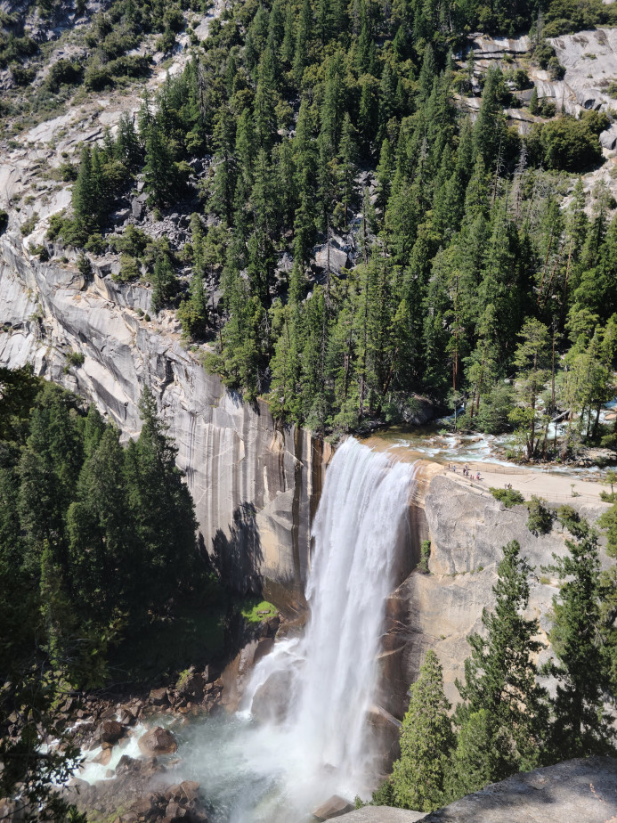
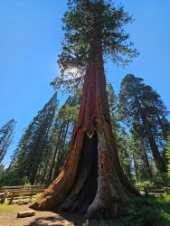

Here are a few images I've shot using my phone on some of my hikes:

## Canadian Hiking

| Sunshine Meadows - _Banff National Park_ | Peyto Lake - _Banff National Park_  |
:-------------------------:|:-------------------------:
  |  

| Emerald Lake - _Yoho National Park_ |   The Grotto - _Bruce Peninsula National Park_  |
:-------------------------:|:-------------------------:
  |  

| Lookout Trail - _Mono Cliffs Provincial Park_ |  Track and Tower - _Algonquin Provincial Park_ |
:-------------------------:|:-------------------------:
  |  

## Californian Hiking

Vernal Falls - _Yosemite National Park_   |  General Sherman - _Sequoia National Park_
:-------------------------:|:-------------------------:
  |  

## Indian Hiking

BR Hills - _Karnataka_   |  Tadiandamol - _Karnataka_
:-------------------------:|:-------------------------:
  |  
